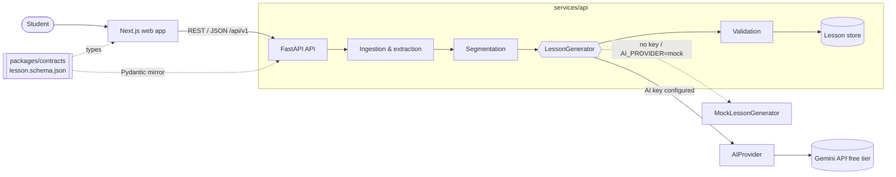

# Architecture overview

## Summary

A monorepo with two deployable apps and one shared contract:

| Part                 | Tech                                 | Responsibility                                            | Owner                                    |
| -------------------- | ------------------------------------ | --------------------------------------------------------- | ---------------------------------------- |
| `apps/web`           | Next.js, TypeScript, Tailwind        | Student experience; renders lessons and visuals from JSON | Person 2, Person 3                       |
| `services/api`       | FastAPI, Pydantic, Google Gen AI SDK | Ingestion, AI pipeline, validation, HTTP API              | Person 1                                 |
| `packages/contracts` | JSON Schema                          | The Lesson data contract both sides depend on             | Person 1 (changes reviewed by consumers) |



## Constraints that shape the design

1. **Zero cost.** The prototype must be buildable and runnable with a $0 AI/API budget. No paid-only
   services; no billing accounts.
2. **Works without AI.** A missing key, exhausted quota or unavailable provider must not make the app
   unusable. Mock mode serves deterministic lessons.
3. **Structured data, not generated UI or images.** Every AI step returns JSON constrained by a
   schema, and the API validates the final result against the Lesson contract. The frontend picks a
   renderer for each section from its `type`, so the same lesson always renders the same way and
   model output cannot inject markup.

## Service boundaries

- **Web → API only over HTTP.** The web app never calls an AI provider and never holds secrets. Its
  only configuration is `NEXT_PUBLIC_API_BASE_URL`.
- **API owns all AI and file handling.** Uploads, transcripts, prompts, model calls and validation
  stay server-side.
- **Contracts are the integration seam.** Frontend and backend work in parallel against
  `packages/contracts`. The example lesson lets the frontend build UI before generation exists.

## Backend layout (`services/api/app`)

| Module       | Role                                                                                                                   |
| ------------ | ---------------------------------------------------------------------------------------------------------------------- |
| `main.py`    | App factory: settings, logging, AI mode, error handlers, request middleware, CORS, routers                             |
| `core/`      | `config.py` (env settings), `logging.py`, `middleware.py` (request id + log line), `errors.py` (error envelope)        |
| `api/`       | Thin HTTP routes, versioned under `/api/v1`                                                                            |
| `schemas/`   | Public API models, including `lesson.py` (Pydantic mirror of the contract)                                             |
| `models/`    | Internal data passed between stages (`SourceInput`, `ExtractedDocument`, `ContentSegment`)                             |
| `ingestion/` | Stage interface `ContentExtractor`; YouTube and PDF implementations go here                                            |
| `services/`  | Non-AI logic: `Segmenter` interface, `LessonStore` + `FileLessonStore`                                                 |
| `ai/`        | `AIProvider` interface, `GeminiProvider`, `factory.py`, `LessonGenerator` interface, `MockLessonGenerator`, `prompts/` |
| `utils/`     | Shared helpers (safe id validation)                                                                                    |

## Lesson pipeline

Each stage has typed input and output, so each can be built and tested alone with fakes for the
stages around it. Status reflects the initial setup.

| #   | Stage                  | Input → output                                                                     | Location                           | Status               |
| --- | ---------------------- | ---------------------------------------------------------------------------------- | ---------------------------------- | -------------------- |
| 1   | Ingestion & extraction | `SourceInput` → `ExtractedDocument` (text blocks with page/time)                   | `app/ingestion/`                   | Interface only       |
| 2   | Segmentation           | `ExtractedDocument` → `list[ContentSegment]`                                       | `app/services/segmentation.py`     | Interface only       |
| 3   | Content analysis (AI)  | segments → knowledge structure (topics, concepts, relationships, processes, facts) | `app/ai/`                          | Planned              |
| 4   | Visual planning (AI)   | knowledge structure → section plan (which representation fits each idea)           | `app/ai/`                          | Planned              |
| 5   | Lesson assembly        | plan → `Lesson` (ids, provenance, `schema_version`)                                | `app/ai/` / `app/services/`        | Planned              |
| 6   | Quiz generation (AI)   | lesson → `QuizQuestion[]` linked to `section_ids`                                  | `app/ai/`                          | Planned              |
| 7   | Validation             | `Lesson` → validated `Lesson`                                                      | `app/schemas/lesson.py` validators | Contract checks done |

Stages 3–6 sit behind the `LessonGenerator` interface. `MockLessonGenerator` implements the same
interface and replaces them when AI is unavailable. Provenance flows through every stage: each
`ContentBlock` has a `SourceReference`, which becomes the `source_references` of generated sections.

## The AI layer

### Provider abstraction

```text
LessonGenerator (pipeline stages)
    └─ AIProvider.generate_structured(instructions, input_text, output_model) -> output_model
         ├─ GeminiProvider      app/ai/gemini_provider.py   (primary, free tier)
         └─ future: OpenRouterProvider, local model provider (e.g. Ollama)
```

- Stages call only `AIProvider`. They never import a vendor SDK, so they can be unit-tested with a
  fake provider at no cost.
- `app/ai/gemini_provider.py` is the **only** module that imports `google.genai`.
- `app/ai/factory.py` is the only module that knows which providers exist:
  - `resolve_ai_mode(settings)` returns `gemini` when `AI_PROVIDER=gemini` and `GEMINI_API_KEY` is
    set, otherwise `mock`.
  - `create_ai_provider(settings)` returns the provider, or `None` in mock mode.
- The mode is logged at startup and reported by `GET /api/v1/health` as `ai_mode`.
- Adding a provider means one new `AIProvider` class, one settings block and one branch in the
  factory.

### Gemini provider

Checked against the official documentation and `google-genai` 2.23 in September 2026.

- **API:** the Interactions API (`client.aio.interactions.create`), which Google marks GA and
  recommended for new projects.
- **Model:** `GEMINI_MODEL`, default `gemini-3.8-flash` (stable, free tier).
- **Structured output:** `response_format={"type": "text", "mime_type": "application/json",
"schema": <output_model JSON schema>}`. The response text is validated with Pydantic; invalid or
  empty output raises `AIProviderError`.
- **Privacy:** `store=False`, so interactions are not kept for later retrieval. Note that free-tier
  content may still be used by Google to improve its products.
- **Errors:** SDK and network errors, including HTTP 429 rate limits, become `AIProviderError`.
  Missing configuration raises `AIConfigurationError`.

### Designing AI-facing models

Gemini structured output supports a subset of JSON Schema, and very large or deeply nested schemas
may be rejected. AI steps therefore use **small, flat intermediate models** designed for the model,
not the full public `Lesson`. Deterministic Python assembles and validates the public `Lesson`.
Prompts live in `app/ai/prompts/`, one module per step.

### Free-tier constraints

- Limits apply per Google Cloud project (not per key) and are visible in AI Studio. Daily quotas
  reset at midnight Pacific time; exceeding a limit returns HTTP 429.
- Design for few calls per lesson, persist generated lessons, never regenerate on page load, and use
  mock mode for rehearsals.
- Free-tier inputs may be reviewed by humans and used to improve Google products: only public,
  non-personal course material.

## Visualizations

The AI never generates images. It describes visuals as structured data in the Lesson contract, and
the web app renders them with code using free, open-source tools (SVG and React components, and
libraries such as Mermaid, Cytoscape.js or D3, Recharts or Chart.js).

| Visual                      | Contract section | Data                                                                                 |
| --------------------------- | ---------------- | ------------------------------------------------------------------------------------ |
| Flowchart, cycle, hierarchy | `diagram`        | `diagram_type`, `nodes[]`, `edges[]`, `summary`                                      |
| Concept relationships       | `concept_map`    | `nodes[]`, labelled `edges[]`, `summary`                                             |
| Bar, line, pie chart        | `chart`          | `chart_type`, `x_axis_label`, `y_axis_label`, `unit`, `series[].points[]`, `summary` |
| Steps                       | `process`        | ordered `steps[]`                                                                    |
| Comparison table            | `comparison`     | `items[]`, `rows[].values[]`                                                         |
| Timeline                    | `timeline`       | ordered `events[]`                                                                   |

Every visual carries a plain-language `summary` used as its text alternative.

## Contracts

`packages/contracts/lesson.schema.json` (JSON Schema 2020-12) is the source of truth.

- **TypeScript:** types are generated into `packages/contracts/src/generated/lesson.ts`
  (`npm run contracts:generate`). CI fails if they are stale.
- **Python:** `app/schemas/lesson.py` mirrors the schema and adds integrity checks JSON Schema cannot
  express. `tests/test_lesson_contract.py` fails on drift (field names, section types, id pattern,
  schema version) and checks that the example validates on both sides.
- **Shape:** a `Lesson` has `schema_version`, `id`, `title`, `overview`, `source`, ordered `sections`
  and `quiz`. Each section is `{id, type, title, source_references, content}`, where `type` is one of
  `concept`, `explanation`, `process`, `comparison`, `timeline`, `example`, `concept_map`,
  `diagram`, `chart`, and `content` has the matching shape.

## Frontend ↔ backend communication

- REST with JSON bodies. All product endpoints are under `/api/v1`. `GET /health` is also available
  unversioned for infrastructure checks.
- Errors always use one envelope: `{"error": {"code", "message", "details?"}}`. Unexpected failures
  return a generic 500 message; stack traces are only logged server-side.
- Every response carries an `X-Request-ID` header that matches the server log line.
- CORS allows only the origins in `CORS_ALLOWED_ORIGINS`. `*` is rejected in production.
- `apps/web/src/lib/api-client.ts` is the single typed client; components do not call `fetch`
  directly.

### Proposed lesson endpoints (not implemented)

| Method | Path                      | Purpose                                                 |
| ------ | ------------------------- | ------------------------------------------------------- |
| `POST` | `/api/v1/lessons/youtube` | Body `{ "url": "..." }`; generate a lesson from a video |
| `POST` | `/api/v1/lessons/pdf`     | Multipart upload; generate a lesson from a PDF          |
| `GET`  | `/api/v1/lessons/{id}`    | Fetch a generated lesson                                |

In mock mode these return the deterministic example lesson. Generation takes tens of seconds in AI
mode: start with a synchronous request and a clear loading state, and move to "create job, then
poll" only if timeouts become a real problem.

## Persistence

No database yet. `LessonStore` is the interface; `FileLessonStore` writes lessons as JSON files under
`DATA_DIR` (default `services/api/.data/`, git-ignored). A database can replace it later without
changing callers.

## Security defaults

- Secrets only in `.env` (git-ignored). Settings are validated at startup; every setting has a safe
  default, so the API starts with no configuration.
- Input validated by Pydantic at the API boundary.
- Ids used in file paths must match `^[A-Za-z0-9_-]{1,64}$`, which blocks path traversal.
- Uploaded filenames are display text only; stored files get server-generated names.
- No shell commands built from user input.
- API docs (`/docs`) are disabled in production.
- Not yet in scope: authentication, rate limiting, upload virus scanning.

## Deliberately excluded (for now)

Authentication, user accounts, databases, job queues (Celery/Redis), microservices, Docker
orchestration, paid AI services, image-generation APIs. Each can be reconsidered when a proven
workflow needs it and it fits the zero-cost constraint.
